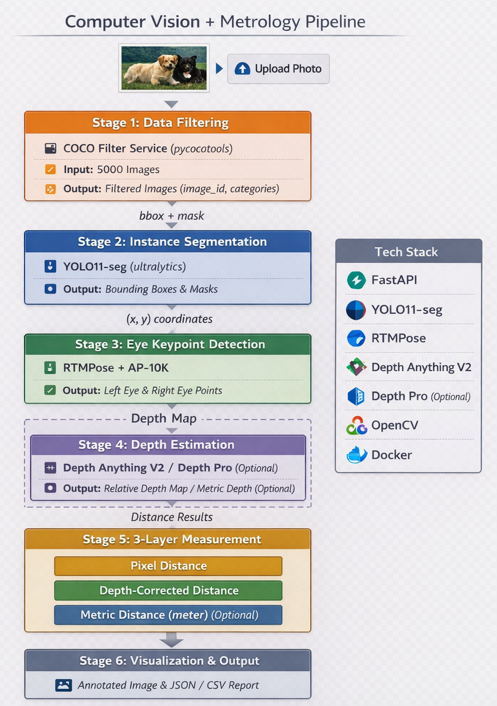
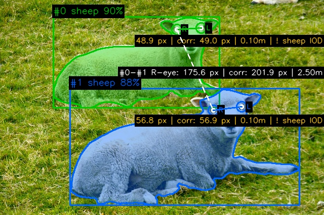

**English** | [中文](README.zh-TW.md)

# Animal Eye Metrology

Image segmentation + metrology pipeline that detects animals in images, locates their eyes, and measures inter-ocular and inter-animal eye distances with three layers of precision.



## Tech Stack

| Component | Technology | Purpose |
|-----------|-----------|---------|
| API Framework | FastAPI | REST API with Swagger UI |
| Instance Segmentation | YOLO11n-seg (ultralytics) | Detect animal contours + bounding boxes |
| Eye Keypoint Detection | RTMPose-m + AP-10K (rtmlib/ONNX) | Locate left/right eye keypoints |
| Relative Depth Estimation | Depth Anything V2 (DA V2) | Per-pixel relative depth for perspective correction |
| Metric Depth Estimation | Apple Depth Pro | Per-pixel metric depth (meters) + focal length |
| Visualization | OpenCV | Annotated result images |
| Containerization | Docker + docker-compose | One-command deployment |

## Three-Layer Measurement Architecture

### Layer 1: Pixel Distance

Straight-line Euclidean distance between two eye coordinates on the 2D image plane — like measuring two points on screen with a ruler. No depth, no camera model, pure planar geometry.

- **Formula**: `d = sqrt((x2-x1)^2 + (y2-y1)^2)`
- **Unit**: pixels
- **Limitation**: No physical meaning — distant animals appear smaller, compressing pixel distances.

### Layer 2: Depth-Corrected Pixel Distance

Still a pixel distance, but corrected for perspective using Depth Anything V2's relative depth map. Solves the problem that distant animals look smaller in the image, compressing their pixel distances. This layer compensates for that compression.

- **Formula**: `corrected = pixel_dist * avg_depth / min(depth_a, depth_b)`
- **Unit**: pixels (perspective-corrected)
- **Advantage**: Proportional relationships are closer to reality than Layer 1
- **Note**: Relative depth only — no absolute scale, so still not a physical measurement
- **API**: Use `depth_pro=fast` to get this layer (~2s, no Depth Pro needed)

### Layer 3: Metric Distance

Uses Apple Depth Pro (ICLR 2025) to get metric depth (meters) and estimated focal length, then projects 2D pixel coordinates into 3D space via the pinhole camera model:

```
X = (x_pixel - cx) * Z / focal_length
Y = (y_pixel - cy) * Z / focal_length
d = sqrt((X2-X1)^2 + (Y2-Y1)^2 + (Z2-Z1)^2)
```

- **Unit**: meters
- **Advantage**: The only layer with true physical meaning — real-world 3D Euclidean distance without camera calibration
- **Note**: Metric depth has estimation error — not lab-grade precision

#### Sanity Check

Cross-validates metric IOD against known biological ranges:

| Animal | Expected IOD |
|--------|-------------|
| Cat | 5-6 cm |
| Dog | 6-10 cm |
| Giraffe | 18-22 cm |
| Sheep | 6-8 cm |

Results: **PASS** (within range), **WARNING** (within 50% tolerance), **FAIL** (unreasonable)

## Quick Start

### Local Setup

```bash
git clone <repo-url>
cd animal-metrology
pip install -r requirements.txt

# For metric depth (optional — ~1.8GB model):
pip install git+https://github.com/apple/ml-depth-pro.git
python -c "from huggingface_hub import hf_hub_download; hf_hub_download('apple/DepthPro', 'depth_pro.pt', local_dir='weights/')"

cp .env.example .env
python -m scripts.run_demo    # Process test images
python -m app.main            # Start API server
```

### Docker

```bash
docker compose up --build
```

API available at `http://localhost:8000`

## API Documentation

Swagger UI: `http://localhost:8000/docs`

### Endpoints

| Method | Endpoint | Description |
|--------|----------|-------------|
| GET | `/health` | Health check |
| GET | `/api/v1/coco/animals` | Browse COCO images with multiple animals |
| POST | `/api/v1/analyze/{image_id}` | Run pipeline on a COCO image |
| POST | `/api/v1/analyze/upload` | Run pipeline on an uploaded image |

### Query Parameters

| Parameter | Values | Default | Description |
|-----------|--------|---------|-------------|
| `steps` | `segment`, `eyes`, `full` | `full` | Pipeline depth |
| `visualize` | `true`, `false` | `true` | Generate annotated image |
| `depth_pro` | `none`, `fast`, `metric` | `metric` | Depth estimation mode |

#### Depth Mode Details

| Mode | Model | Output (cumulative) | Speed |
|------|-------|---------------------|-------|
| `none` | — | `pixel_distance` | Instant |
| `fast` | Depth Anything V2 | + `depth_corrected_px` | ~2s |
| `metric` | Apple Depth Pro | + `metric_distance_m` + sanity check | ~30-60s |

> Each mode includes all fields from the previous mode. `metric` returns all three layers.
> If Depth Pro is not installed and `metric` is selected, the system automatically falls back to `fast` mode and logs a warning.

### Examples

```bash
# Full pipeline with all 3 layers (default, ~30-60s)
curl -X POST "http://localhost:8000/api/v1/analyze/287545"

# Full pipeline, pixel distance only (fastest)
curl -X POST "http://localhost:8000/api/v1/analyze/287545?depth_pro=none"

# Full pipeline with depth-corrected pixel distance (~2s)
curl -X POST "http://localhost:8000/api/v1/analyze/287545?depth_pro=fast"

# Segmentation only, JSON only
curl -X POST "http://localhost:8000/api/v1/analyze/287545?steps=segment&visualize=false"

# Eye detection with visualization, no depth
curl -X POST "http://localhost:8000/api/v1/analyze/287545?steps=eyes&depth_pro=none"

# Upload image (no COCO required)
curl -X POST "http://localhost:8000/api/v1/analyze/upload" \
  -F "file=@my_photo.jpg" -G -d "depth_pro=fast"
```

## Example Output



The annotated image shows all three layers of the pipeline output:

- **Colored masks + contours**: Instance segmentation results (each animal gets a unique color)
- **Eye markers (L/R)**: Detected left/right eye keypoints with circle frames
- **Solid lines**: Intra-animal binocular distance (between an animal's own eyes)
- **Dashed white lines**: Inter-animal distance (between right eyes of different animals)

#### Reading the Distance Labels

**Intra-animal label** (on solid lines) — cumulative by depth mode:

```
# depth_pro=none
48.9 px

# depth_pro=fast (DA V2)
48.9 px | corr: 52.3 px

# depth_pro=metric (Depth Pro) — includes all layers
48.9 px | corr: 52.3 px | 0.10m | ! sheep IOD
```
- `48.9 px` — Layer 1: pixel distance
- `corr: 52.3 px` — Layer 2: depth-corrected pixel distance (perspective-compensated)
- `0.10m` — Layer 3: metric distance estimated by Depth Pro (meters)
- `! sheep IOD` — Sanity check result against known biology

**IOD** = Inter-Ocular Distance (the distance between an animal's two eyes). Each species has a known biological IOD range used to validate whether the metric measurement is reasonable.

**Sanity check icons**:
- `v` (green) = **PASS** — metric distance within expected IOD range
- `!` (yellow) = **WARNING** — outside range but within 50% tolerance
- `x` (red) = **FAIL** — clearly unreasonable, likely eye detection or depth error

**Inter-animal label** (on dashed lines) — cumulative by depth mode:

```
# depth_pro=none
#0-#1 R-eye: 175.6 px

# depth_pro=fast
#0-#1 R-eye: 170.5 px | corr: 184.7 px

# depth_pro=metric
#0-#1 R-eye: 175.6 px | corr: 184.7 px | 2.50m
```
- `#0-#1` — animal pair IDs
- `R-eye` — measured between each animal's right eye
- `175.6 px` — pixel distance
- `corr: 184.7 px` — depth-corrected pixel distance
- `2.50m` — metric distance (no sanity check — no biological reference for inter-animal distance)

## Test Images

| Image ID | Animals | Description |
|----------|---------|-------------|
| 287545 | 2 giraffes | Large animals, different depths |
| 402473 | 2 cats | Small animals, similar depth |
| 547383 | 2 sheep | Medium animals, different depths |

## Model Selection Rationale

### YOLO11n-seg
- **Why**: COCO pretrained, detection + segmentation in one pass, nano variant for CPU
- **Metrics**: mAP@50 = 73.4 on COCO val2017
- **Evaluation**: IoU (Intersection over Union) measures segmentation mask quality

### RTMPose-m + AP-10K
- **Why**: AP-10K is the standard animal pose benchmark (17 keypoints, 23 species)
- **Metrics**: AP@0.5 = 72.2 on AP-10K
- **Evaluation**: OKS (Object Keypoint Similarity) measures keypoint accuracy
- **Delivery**: ONNX format via rtmlib — avoids heavy mmpose/mmcv dependency

### Depth Anything V2
- **Why**: High-quality relative depth maps for perspective correction (Layer 2)
- **Advantage**: Lightweight, fast, no focal length needed — only relative ordering matters
- **Design**: Used in Layer 2 to compensate for perspective compression in pixel distances

### Apple Depth Pro
- **Why**: Outputs metric depth (meters) + estimated focal length — no camera calibration needed
- **Paper**: "Depth Pro: Sharp Monocular Metric Depth in Less Than a Second" (ICLR 2025)
- **Evaluation**: AbsRel, RMSE on standard benchmarks (NYU, KITTI)
- **Design**: Powers Layer 3 (metric distance); optional — pipeline gracefully falls back to pixel-only if unavailable

## Verification Methods

1. **Visual**: Annotated images with eye markers, distance lines, and 3-layer labels
2. **Sanity Check**: Metric IOD cross-validated against known animal biology
3. **Unit Tests**: 27 tests covering distance computation, metric projection, sanity check logic
4. **Demo Script**: `python -m scripts.run_demo` processes all test images end-to-end

## Limitations

- **Metric depth accuracy**: Depth Pro is zero-shot — error varies by scene. Sanity checks help flag outliers.
- **Eye detection**: RTMPose may fail on profile views (eyes set to None, distances skipped)
- **YOLO threshold**: 0.5 confidence may miss partially occluded animals
- **CPU inference**: Depth Pro takes ~30-60s per image on CPU; GPU recommended for production
- **No camera calibration**: Depth Pro estimates focal length, but true calibration would be more accurate

## Running Tests

```bash
python -m pytest tests/ -v
```

## Project Structure

```
animal-metrology/
├── app/
│   ├── main.py                     # FastAPI entry point
│   ├── config.py                   # Pydantic settings
│   ├── models/schemas.py           # Response schemas (3-layer)
│   ├── routers/analyze.py          # API endpoints
│   ├── services/
│   │   ├── coco_filter.py          # COCO dataset filtering
│   │   ├── segmentation.py         # YOLO instance segmentation
│   │   ├── eye_detection.py        # RTMPose eye keypoints
│   │   ├── depth_estimation.py     # Depth Pro / DA V2
│   │   └── measurement.py          # 3-layer distance computation
│   └── utils/visualization.py      # Result visualization
├── tests/                          # Unit + integration tests
├── data/
│   ├── test_images/                # 3 pre-selected COCO images
│   ├── test_annotations/           # Minimal COCO annotation JSON
│   └── sample_results.csv          # Pipeline output CSV
├── scripts/
│   └── run_demo.py                 # One-command demo
├── docs/architecture.png
├── Dockerfile, docker-compose.yml
├── requirements.txt, .env.example
└── README.md
```
